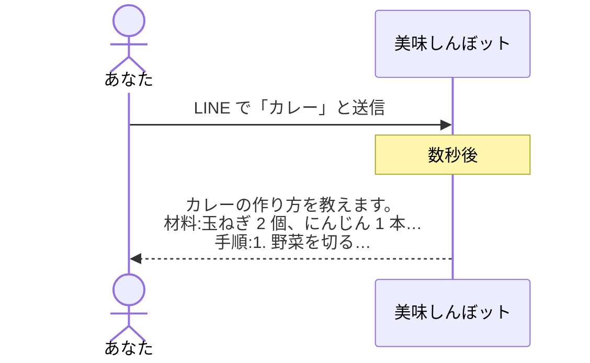
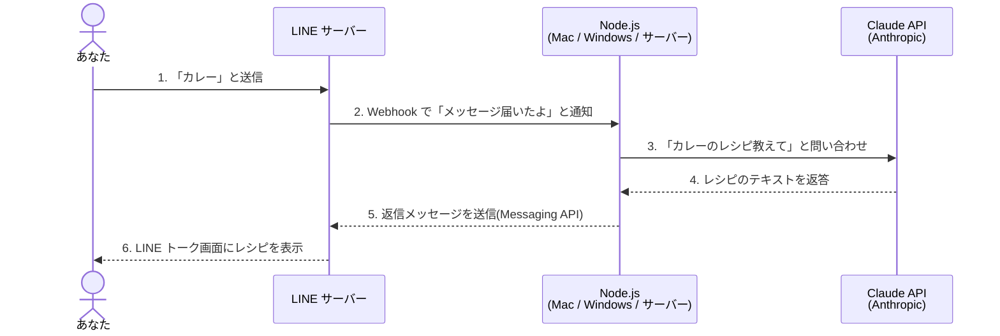

# oishinbot

# LINE bot ワークショップ：「美味しんぼット」を作ろう

- 開発未経験の方向けのワークショップです
- AI(Claude.app)を利用して、LINE で料理名を送るとレシピを返してくれる bot を作ります
- その名も、「美味しんぼット」

## 目次

- [はじめに](#はじめに)
- [今日作るもの](#今日作るもの)
- [Part 1: 環境準備](#part-1-環境準備)
- [Part 2: アカウント作成](#part-2-アカウント作成)
- [Part 3: 美味しんぼットを作る](#part-3-美味しんぼットを作る)
- [まとめ](#まとめ)
- [付録: 用語集](#付録-用語集)

## はじめに

### 今日のゴール

LINE で料理名(例:「カレー」)を送ると、
レシピが返ってくる「美味しんぼット」を作ります。
ただし今日の本当のゴールは、bot を作ることではありません。
「自分でも動くものが作れる」という感覚を持ち帰ってもらうことです。

### 1. 「やりたいこと」があれば、実現できる

数年前まで、何かアプリやツールを作りたければ
「プログラミングを学ぶ」しかありませんでした。
AI の登場により、AI に指示を出せば、コードは AI が書いてくれます。
「コードを書く能力」ではなく、「何を作りたいかを言語化する能力」で、
動くものが作れます。
今日は実際にそれを体験してもらいます。

### 2. 「やりたいこと」を詳しく説明できる能力

ここが今日一番大事な話です。

英語のプロ 100 人を前に「英語を教えてください」と言っても、
いい授業は返ってきません。
あなたが ABC レベルなのか、ビジネス英語が必要なのか、TOEIC を受けるのか、
海外旅行で使いたいのか…背景と目的を共有して初めて、
相手は的確に教えてくれます。

AI も全く同じです。「アプリ作って」では何も作れません。
「LINE で料理名を送ったらレシピを返す bot を Node.js で作って」まで言って、
ようやく動くものが返ってきます。

AI が賢くなれば指示は適当でいい、は嘘です。
むしろ AI が賢くなるほど、適当な指示は適当な結果を、
丁寧な指示は丁寧な結果を返すようになります。

### 3. 「動くもの」と「リリースできるアプリ」は別物

今日作る美味しんぼットは「動くもの」です。
「リリースできるアプリ」ではありません。
本物のサービスには、ユーザー認証、データベース、エラー対応、
セキュリティ、課金、規約…無数の要素が必要です。

でも、それは今日考えなくていいです。まず「動くもの」で遊んでみる。
これが全ての入り口です。
料理を始めるときに、いきなりレストランの事業計画なんて書きません。
今日の一歩がなければ、その先もありません。

## 今日作るもの

### 完成イメージ



### 全体像

今日作るシステムの登場人物は 4 人(4 つ)です。
あなた → LINE → あなたの PC の Node.js → Claude API、
の順番でメッセージが流れて、また逆順に返ってきます。



1. あなたが LINE で「カレー」と送信
2. LINE のサーバーが、あなたの PC に「メッセージが届いたよ」と知らせる(Webhook)
3. あなたの PC で動いている Node.js が、Claude API に「カレーのレシピ教えて」と聞く
4. Claude API が答えを返す
5. その答えを Node.js が LINE のサーバー経由であなたに送り返す
6. あなたの LINE にレシピが届く

> [!NOTE]
> 今日コードを書くのは Claude.app(デスクトップアプリ) ですが、
> 出来上がった bot が動かしている AI も Claude(API 経由) です。
> 「コードを書く Claude」と「bot の頭脳になる Claude」があります。

### 用語をシンプルに

| 用語       | シンプルな説明                                                    |
| ---------- | ----------------------------------------------------------------- |
| Claude.app | AI と話しながらコードを書いて、その場で動かせるデスクトップアプリ |
| サーバー   | パソコンのこと。今日はあなたの MacBook / Windows PC がこれになる  |
| Node.js    | パソコンの上で JavaScript というプログラムを動かすための道具      |
| API        | あるサービスに「こういう情報ください」と聞ける窓口                |
| ngrok      | あなたの PC を、一時的に世界からアクセスできるようにする道具      |
| Webhook    | 「何かが起きたら教えてね」という通知の仕組み                      |

## Part 1: 環境準備

コードを書く前に、コードを動かす準備をします。
今日は ほとんどクリックだけで進められる ようにしました。
ターミナル(黒い画面)はほぼ触りません。

### 1-1. Claude.app のインストール

「Claude.app」は AI と話しながらコードを書いてもらえる Anthropic 公式の
デスクトップアプリです。今日のコードは Claude が書いて、Claude が動かします。

1. ブラウザで [https://claude.ai/download](https://claude.ai/download) を開く
2. お使いの OS のインストーラをダウンロードしてインストール
3. アプリを起動し、アカウント作成、もしくは既存アカウントでログイン

> [!NOTE]
> Claude.app の無料プランでも進められますが、短時間で利用回数の上限に達することがあります。
> ワークショップ中に上限で止まらないよう、Pro プランがあると安心です。

### 1-2. プロジェクト用のフォルダを作る

今日以降、AI で何か作るときの 「作業場所」 になるフォルダを作ります。

1. マウスでデスクトップに 「プロジェクト」 という名前のフォルダを作成 or 移動
2. これでデスクトップに `プロジェクト/` フォルダができました
3. `プロジェクト/oishinbot` を作成してください

> [!NOTE]
> 来週別のものを作りたくなったら、同じ「プロジェクト」フォルダの中に
> また別のサブフォルダを作ればいい、という考え方です。

### 1-3. Claude.app でプロジェクトを開く

1. Claude.app を起動
2. 新しい会話を開始
3. 「+」 → 「フォルダを追加」から、先ほど作った `プロジェクト/oishinbot` フォルダを選択
4. Claude が `プロジェクト/oishinbot` フォルダの中でファイルを読み書き・コマンド実行できる状態になります

> [!NOTE]
> ここから先、Claude が「コマンドを実行してもいいですか」と聞いてきたら、
> 毎回 「許可」 を押してください。

### 1-4. Node.js を Claude に入れてもらう

bot は Node.js という道具の上で動きます。
これは「JavaScript というプログラム言語をパソコン上で動かすための道具」です。
入っているかどうかを確認して、入っていなければ Claude に入れてもらいましょう。

Claude.app に以下を送ります:

```
今日は LINE bot を一緒に作ることが目的です。
まず私の PC に Node.js が入っているか確認してください。
入っていなければ、私の OS に合った方法でインストールしてください。
最後に `node -v` を実行して、バージョンを教えてください。
```

`v22.x.x` のような表示が返ってくれば、環境は OK です。

> [!NOTE]
> Mac の場合、Claude が Homebrew 経由でインストールしようとして Homebrew 自体のインストールから始まります。
> 数分かかることもありますが、最後まで「許可」で進めれば大丈夫です。
> [https://nodejs.org/](https://nodejs.org/) の LTS 版 を自分でダウンロードしてインストールしても OK。

## Part 2: アカウント作成

3 つのサービスにアカウントを作ります。
それぞれ「何のためか」を意識すると迷いません。

### 2-1. LINE Developers(LINE bot を作るため)

#### 何をするか

LINE bot を動かすには、LINE 側に「これから bot を作ります」と登録する必要があります。

#### 手順

1. [https://developers.line.biz/console/](https://developers.line.biz/console/) にアクセス
2. 右上の「ログイン」→ 普段使っている LINE アカウントでログイン
3. 開発者情報(名前とメールアドレス)を入力
4. 「プロバイダー」を作成 → 名前は自分の名前や好きな名前で OK
5. プロバイダーの中で 「Messaging API」チャネルを作成
   - チャネル名:好きな名前(例:「美味しんぼット」)
   - チャネル説明:何でも OK
   - 大業種・小業種:「個人」→「個人(その他)」など
6. 作成後、チャネルの設定画面で以下 2 つの値を取得します:

#### 必要な情報 2 つ

| 名前                         | どこにあるか                                                                   |
| ---------------------------- | ------------------------------------------------------------------------------ |
| チャネルシークレット     | 「チャネル基本設定」タブ                                                       |
| チャネルアクセストークン | 「Messaging API 設定」タブ → 「チャネルアクセストークン(長期)」→「発行」ボタン |

> [!NOTE]
> チャネルアクセストークンは「発行」ボタンを押さないと表示されません。
> 発行後はメモしておいてください(漏らさないように)。

#### 重要な設定変更

「Messaging API 設定」タブで以下を変更してください:

- 「応答メッセージ」: 無効にする(LINE の自動返信機能を OFF)
- 「あいさつメッセージ」: 無効にする(任意ですが、邪魔なので OFF 推奨)
- 「Webhook の利用」: 有効にする(これがないと、メッセージが届きません)

Webhook URL は後で設定します。

#### 美味しんぼットを友だち追加

「Messaging API 設定」タブの下の方に、QR コードがあります。
スマホの LINE で読み取って、自分の美味しんぼットを友だち追加してください。

### 2-2. Anthropic API キーの取得(bot の頭脳のため)

#### 何をするか

美味しんぼットの頭脳となる Claude AI を呼び出すための「鍵」を取得します。

> [!NOTE]
> これは Claude.app のログインとは 別物 です。
> Claude.app は「あなたが Claude と話す」もの、API キーは「あなたの bot が Claude と話す」ためのものです。

#### 手順

1. [https://console.anthropic.com/](https://console.anthropic.com/) にアクセス
2. アカウント作成(Google ログインが楽)
3. ログイン後、左メニューの 「API Keys」 をクリック
4. 「Create Key」 をクリック → 名前は何でも OK(例:「oishinbot」)
5. 表示された API キー(`sk-ant-...` で始まる長い文字列)をコピーしてメモ

> [!WARNING]
> このキーは一度しか表示されません。
> 閉じる前に必ずメモしてください。
> 万が一なくしても、削除して再発行すれば大丈夫です。

#### クレジットの追加

Claude API は使った分だけ課金されます。少額のクレジットを追加しておきます。

1. 左メニューの 「Billing」
2. 「Add to credit balance」 から $5 ほどチャージ
3. クレジットカード情報を入力

> [!NOTE]
> 今日のワークショップで使う API 呼び出しは、Haiku モデルなら 1 回あたり 0.001 ドル前後です。
> $5 もあれば数千回試せます。

### 2-3. ngrok(あなたの PC を世界に公開するため)

#### 何をするか

LINE のサーバーは、あなたの PC に「メッセージが届いたよ」と知らせる必要があります。
でも普通、家の PC には外からアクセスできません。

ngrok は「一時的に表札を出してくれる道具」です。

#### 手順(アカウント作成だけ)

1. [https://ngrok.com/](https://ngrok.com/) にアクセス
2. 「Sign up」 からアカウント作成
3. ログイン後、ダッシュボードに表示される authtoken をコピーしてメモ

- `Your Authtoken` という欄の長い文字列

ngrok 本体のインストールと設定は Part 3 で Claude にお任せします。

## Part 3: 美味しんぼットを作る

ここからは Claude.app に話しかけるだけ で進みます。
ターミナル（黒い画面）は Claude が裏側で勝手に叩いてくれます。

### 3-1. Claude に bot を作ってもらう

Part 1-3 で開いた `プロジェクト/oishinbot` フォルダがそのまま「作業場所」になります。
Claude.app の入力欄に、以下を丸ごとコピペしてください:

```
今開いているこのフォルダの中に、LINE bot を Node.js で作ってください。

要件:
- LINE で料理名(例: カレー、肉じゃが、麻婆豆腐)を送ると、その料理のレシピを返す bot
- レシピは Anthropic の Claude API(モデル: claude-haiku-4-5)を使って生成する
- ローカル(私の PC)で動かす想定。ngrok 経由で LINE と通信する
- Express を使って Webhook を受け取る。ポートは 3000 で起動する
- 環境変数(.env ファイル)で以下の値を管理:
  - LINE_CHANNEL_ACCESS_TOKEN (LINE にメッセージを返信するため)
  - LINE_CHANNEL_SECRET (Webhook の署名検証に使う)
  - ANTHROPIC_API_KEY
- Webhook のエンドポイントは /webhook
- LINE_CHANNEL_SECRET を使った Webhook 署名検証も実装してください
- package.json も作ってください
- 起動コマンドは npm start で動くようにしてください

作成が完了したら、npm install まで実行して、エラーが出ないか確認してください。
```

> [!NOTE]
> このプロンプトの「具体性」 を意識してください。
> 「LINE bot を作って」だけだと、何で作るか、どうやって動かすか、どこに何を保存するか、全部 AI 任せになります。
> 具体的に指示すると、具体的な答えが返ります。

Claude が `プロジェクト/oishinbot/` の中にファイルを作り、パッケージのインストールまで実行してくれます。
コマンド実行の許可を求められたら 「許可」 を選択してください。

### 3-2. .env ファイルに値を設定

Claude が `.env.example` のようなテンプレートを作ってくれているはずです。
Claude に以下のように頼みます:

```
.env.example をコピーして .env を作って、以下の値を入れてください:

ANTHROPIC_API_KEY=sk-ant-xxxxxxxxxxx
LINE_CHANNEL_ACCESS_TOKEN=ここに長いトークンを貼り付け
LINE_CHANNEL_SECRET=ここにシークレットを貼り付け
```

(`sk-ant-xxxxxxxxxxx` などの部分は、Part 2 で取得した自分の値 に置き換えてください)

> [!WARNING]
> `=` の前後に スペースを入れないでください。
> `KEY = value` ではなく `KEY=value` です。

### 3-3. 美味しんぼットを起動する + ngrok で公開する

Claude に以下を一気に頼みます:

```
bot を起動して、ngrok で公開するところまでやってほしいです。

1. npm start で bot をバックグラウンドで起動
2. ngrok がまだなければインストール
3. ngrok の authtoken を設定(私の authtoken は xxxxxxxxxx です)
4. ngrok http 3000 でバックグラウンドで公開
5. 公開された https の URL を教えてください
```

(`xxxxxxxxxx` の部分は、Part 2-3 でコピーした 自分の authtokenに置き換えてください)

Claude が順番に実行してくれて、最終的に `https://abcd-1234-5678.ngrok-free.app` のような URL を教えてくれます。

> [!NOTE]
> ターミナルウィンドウを 2 つ開いて切り替えて…のような操作は不要です。
> Claude.app が裏でプロセスを起動しっぱなしにしてくれます。
> コマンド実行の許可は毎回「許可」を押してください。

### 3-4. LINE 側に Webhook URL を登録

Claude が教えてくれた URL を、LINE Developers 側に貼り付けます。

1. [LINE Developers](https://developers.line.biz/console/) のあなたのチャネルを開く
2. 「Messaging API 設定」タブ
3. 「Webhook URL」 に以下を入れる:

```
https://abcd-1234-5678.ngrok-free.app/webhook
```

(`abcd-...` の部分は、Claude が教えてくれた URL に置き換える。末尾の `/webhook` を忘れずに付けてください)

4. 「更新」ボタン → 「検証」ボタン → 「成功」と出れば OK
5. 「Webhook の利用」が ON になっていることを確認

### 3-5. いよいよ動作確認!

スマホの LINE で、自分の美味しんぼットに料理名(例:「カレー」)を送ってみてください。

数秒後にレシピが返ってきたら 🎉 大成功です!

### 3-6. もし動かなかったら

落ち込まないでください。エラーが出るのは普通です。

Claude.app の良いところは、ログも Claude 自身が読める ことです。以下のように聞くだけで OK です:

```
LINE に送ってもレシピが返ってきません。
何が起きているか調べて、直してもらえますか?
```

Claude が:

- bot のログを確認
- ngrok のログを確認
- 怪しいところを特定
- 必要なら修正してテスト

までやってくれます。
LINE 側にエラーメッセージが見えていれば、それも貼ってあげると精度が上がります。

## まとめ

### 今日やったことを 1 行で

何かしらの情報を、任意のタイミングで、取得して、返した。

これだけです。でもこれが、世の中のあらゆる Web サービスの基本形です。

### 持ち帰ってほしい 3 つのこと

1. 「やりたいこと」を具体的に言語化できれば、AI が手伝ってくれる時代
2. エラーは怖くない。エラーの状況を AI に共有すれば、9 割は解決する
3. 「動くもの」が作れた今日の体験は、AI 時代の第一歩

> 問題は、すばらしいアイデアとすばらしい製品の間には、とてつもない職人技の積み重ねが必要だということなんだ。
> それに、アイデアを発展させていく過程で、そのアイデアは変貌し、成長する。
> とりかかった時点で考えていたものと同じものができあがることなんて絶対にない。
> 細部を詰めていくに従って多くのものを学ぶし、妥協しなければならない点も無数に出てくるからだ。
> 電子にはできないことが必ずある。
> プラスチックにはできないこと、ガラスにはできないこと、工場やロボットにはできないことがね。
> こういったことすべてが絡んでくるから、製品を設計するというのは、5000のことを頭の中で考えるのと同じなんだ。
> そうしたコンセプトを一つにまとめて、
> それまでとは異なる新しいやり方で組み合わせたりして、自分がほしいものを生み出す。
> 問題であれチャンスであれ、毎日何かしら新しいものが現れるたびに、全体をまた少し違った形で組み直すことになるわけだ。
> その過程がマジックなんだよ。

### 次の一歩

- 美味しんぼットの機能を増やしてみる(例:「献立提案して」「カロリーも教えて」)
- 別の API を使ってみる(例: 天気、為替、ニュース)
- パソコンを開いていない時にも使いたい！(deploy, GitHub, Vercel...)
- 「コードを読む」「ターミナルから動かす」に挑戦してみたければ、また別日に!

### 大事なこと

- X/Twitter の AI 驚き屋は全てブロックしてください
  - これからはエンジニアリングではなくてプロンプトエンジニアリング笑
  - AI Agent で 30人の部下を作って会社経営しています笑
  - これからの時代はハーネスエンジニリング笑
  - 速報！ついに AI で自動的に収益が出せる仕組みが出ました笑
  - これからはエンジニア不要！エンジニアの仕事は無くなります笑
  - これらは全部ゴミでありクソ、ノイズです
  - 何を発信しているのか？ではなくて、何を作っているのか以外は信じる必要なし
- わからないことがわからない、という状況を認めて、常に AI に相談しましょう
- AI は間違えることがあります
  - ただし、AI は 99%以上の人類より賢いです
  - では、なぜ間違えるのか？この問いを持つことが大事です
  - 質問の方法は十分に妥当だったのか？ウェブ検索をして最新の情報を取得してもらっているのか？
- AI はなぜこのように振る舞うのか？これは実は科学的には完全に解明されていません
  - 飛行機はなぜ飛ぶのか？自転車はなぜまっすぐ走れるのか？科学よりも工学の方が先行していることを理解しましょう

## 付録: 用語集

| 用語             | 説明                                                            |
| ---------------- | --------------------------------------------------------------- |
| API          | あるサービスに「こういう情報ください」と聞ける窓口              |
| API キー     | API を使うときの「身分証明書」。漏らすと悪用される              |
| Claude.app   | AI と話しながらコードを書けるデスクトップアプリ                 |
| Express      | Node.js で Web サーバーを作る道具(フレームワーク)               |
| Node.js      | パソコンで JavaScript を動かすための道具                        |
| npm          | Node.js のパッケージ管理ツール。`npm install ◯◯` で道具を入れる |
| ngrok        | ローカルの PC を一時的に外部公開する道具                        |
| package.json | プロジェクトに必要な道具一覧を書いたファイル                    |
| Webhook      | 「何かが起きたら教えてね」という通知の仕組み                    |
| 環境変数     | コードに直接書かない秘密の値(API キー等)。`.env` に書く         |

お疲れさまでした! 🎉
